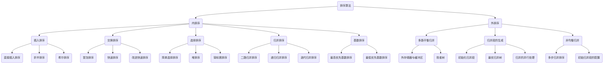

# 排序算法

```mermaid
graph TD
A(排序算法)-->B1(内排序)
A-->B2(外排序)
B1-->C1(插入排序)
B1-->C2(交换排序)
B1-->C3(选择排序)
B1-->C4(归并排序)
B1-->C5(基数排序)
B2-->D1(多路平衡归并)
B2-->D2(归并段的生成)
B2-->D3(非均衡归并)
C1-->f1(直接插入排序)
C1-->f2(折半排序)
C1-->f3(希尔排序)
C2-->g1(冒泡排序)
C2-->g2(快速排序)
C2-->g3(改进快速排序)
C3-->h1(简单选择排序)
C3-->h2(堆排序)
C3-->h3(锦标赛排序)
C4-->i1(二路归并排序)
C4-->i2(递归归并排序)
C4-->i3(迭代归并排序)
C5-->j1(最高优先基数排序)
C5-->j2(最低优先基数排序)
D1-->e1(外存储器与缓冲区)
D1-->e2(败者树)
D2-->e4(初始化归并段)
D2-->e5(最优归并树)
D2-->e6(归并的并行处理)
D3-->e7(多步归并排序)
D3-->e8(初始归并段的配置)
```
